# African Population Genomics

**Population structure, genetic differentiation, and pharmacogenomic relevance of African populations using 1000 Genomes Project Phase 3 data**

> A bioinformatics portfolio project analysing chromosome 22 from 2,504 unrelated individuals across 26 populations and 5 superpopulations, with a focus on within-Africa diversity and its clinical implications for drug metabolism.

---

## Background

Most genomic research — and most clinical dosing guidelines — are built on data from populations of European descent. African populations carry more genetic diversity than any other continental group (a direct consequence of humanity's origin in Africa), yet they remain systematically underrepresented in both research datasets and pharmacogenomic databases.

This project asks a simple question with clinical consequences: **how much population structure exists within and between African populations, and does it reach into regions of the genome that matter for drug metabolism?**

The answer matters because genes like *CYP2D6* — responsible for metabolising roughly 25% of commonly prescribed drugs including codeine, tamoxifen, and many antipsychotics — carry population-specific alleles that directly affect whether a standard dose works, fails, or causes toxicity. The African-specific allele CYP2D6\*17, present in 20–34% of West and East Africans but rare elsewhere, reduces enzyme activity in ways that standard dosing algorithms do not account for.

This project builds the evidence for that clinical gap using real genomic data, industry-standard tools, and rigorous statistical methods — then honestly identifies where the analysis pipeline's own design choices limit what it can conclude.

---

## Key Findings

### Global population structure separates five continental groups

PCA on 5,141 LD-pruned chr22 variants cleanly resolves five superpopulation clusters. PC1 (53.3% variance) separates African from non-African ancestry; PC2 (21.6%) separates East Asian from European/South Asian. The AMR (Americas) cluster is smeared along a gradient between AFR and EUR, reflecting documented colonial-era admixture.

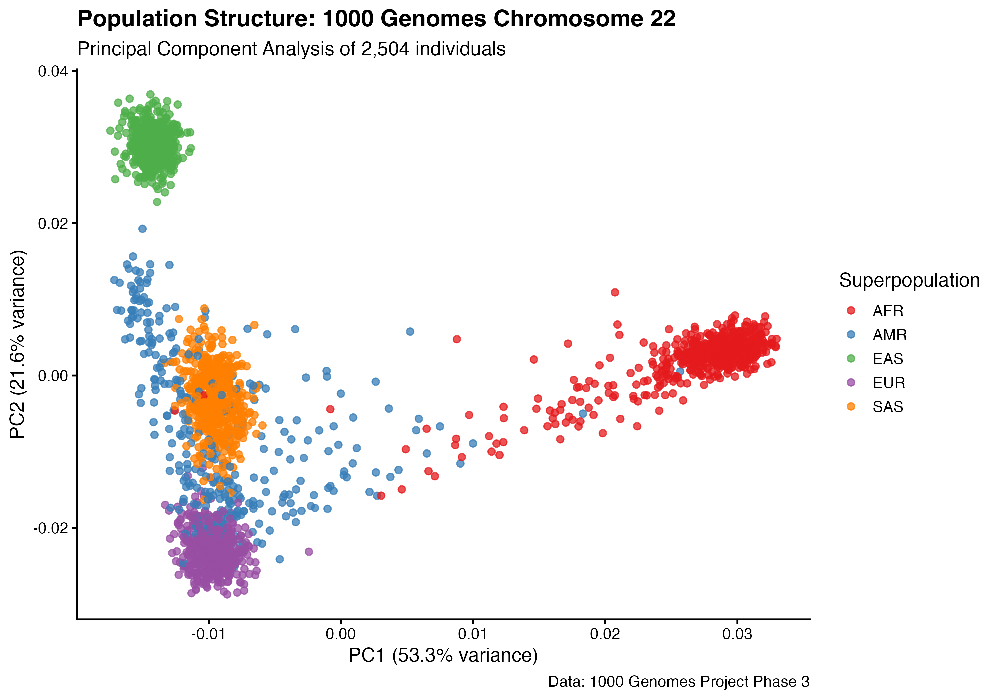

### Unsupervised ancestry analysis independently recovers continental groups

ADMIXTURE at K=5 assigns each individual a proportion of five inferred ancestry components — without seeing any population labels. The five components map directly onto the five superpopulations, independently confirming the PCA structure. K=5 was selected via cross-validation error (elbow at K=5; the K5→K6 improvement is 6× smaller than K4→K5).

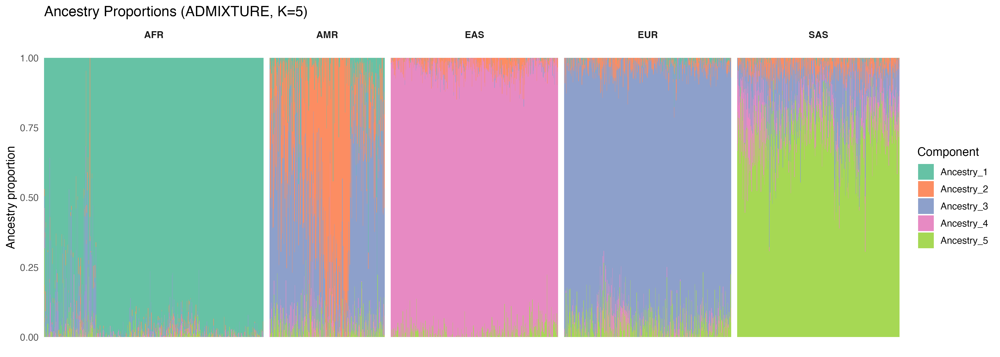

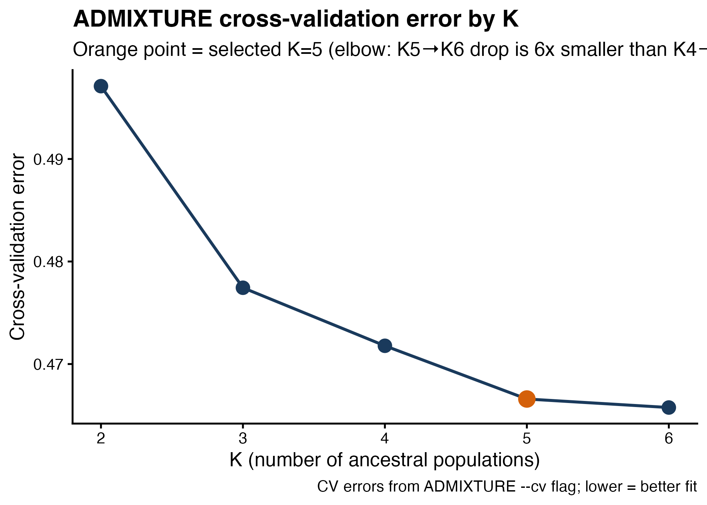

### AFR–EAS is the most differentiated pair, not AFR–EUR

Weir & Cockerham Fst across all 10 superpopulation pairs shows AFR–EAS as the most differentiated (~0.12), followed by AFR–EUR (~0.10). This is consistent with the serial founder effect model (Ramachandran et al. 2005): populations that migrated furthest from Africa through the fewest bottlenecks accumulated the most differentiation. AMR–EUR is lowest (~0.02), reflecting recent European admixture in the Americas.

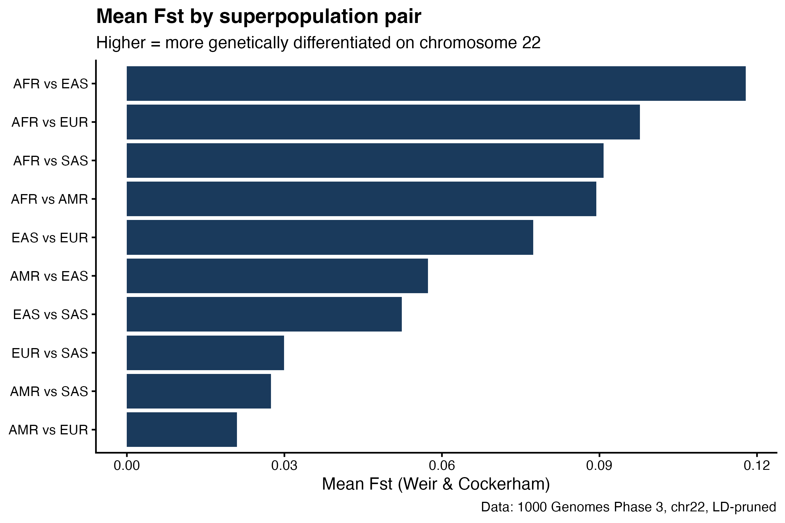

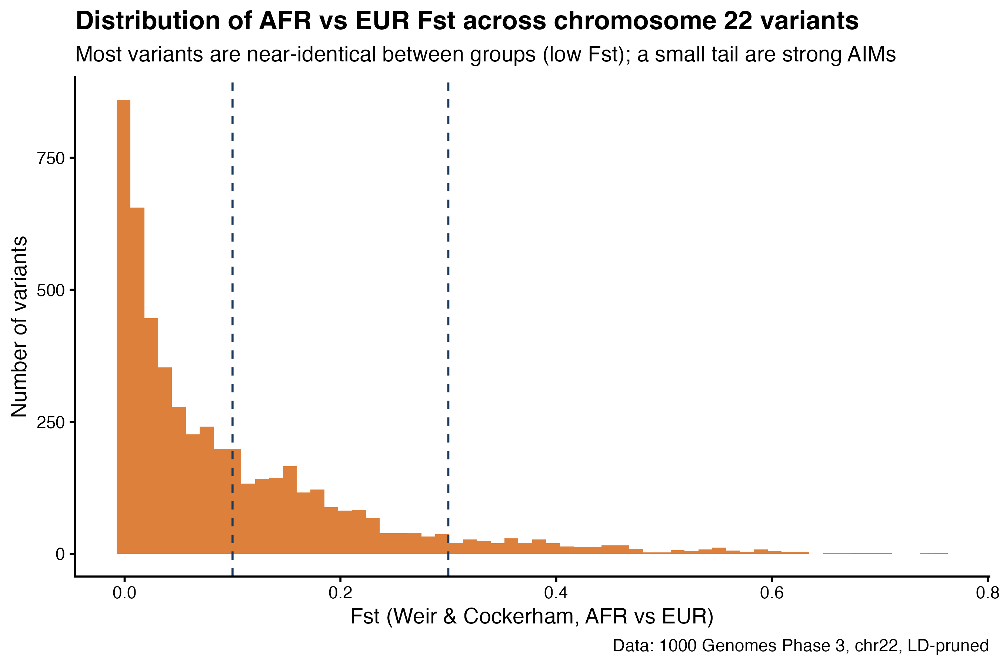

### Within-Africa PCA is dominated by diaspora admixture

When PCA is restricted to the 7 AFR populations, PC1 (26.9%) is driven almost entirely by the European admixture axis — ACB (African Caribbeans in Barbados) and ASW (African Americans in SW USA) scatter far to the left, away from the tight continental cluster. Removing ACB and ASW reveals genuine geographic structure among the five continental populations: LWK (Luhya, Kenya) separates from the West African cluster on PC1, and GWD (Gambian Mandinka) partially separates on PC2.

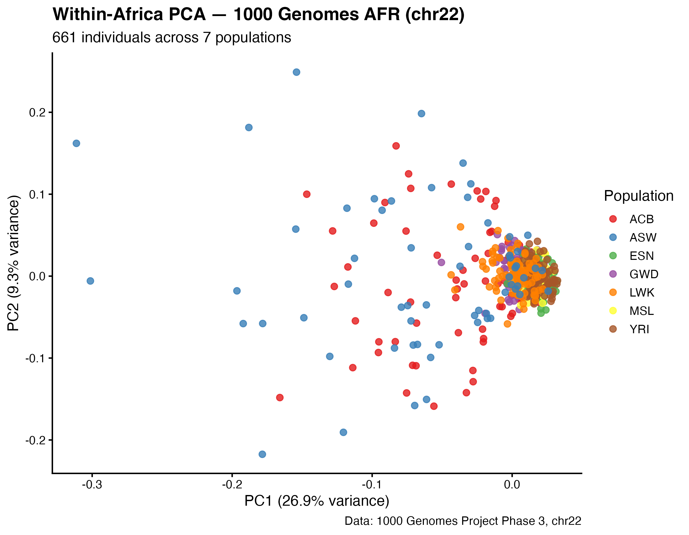

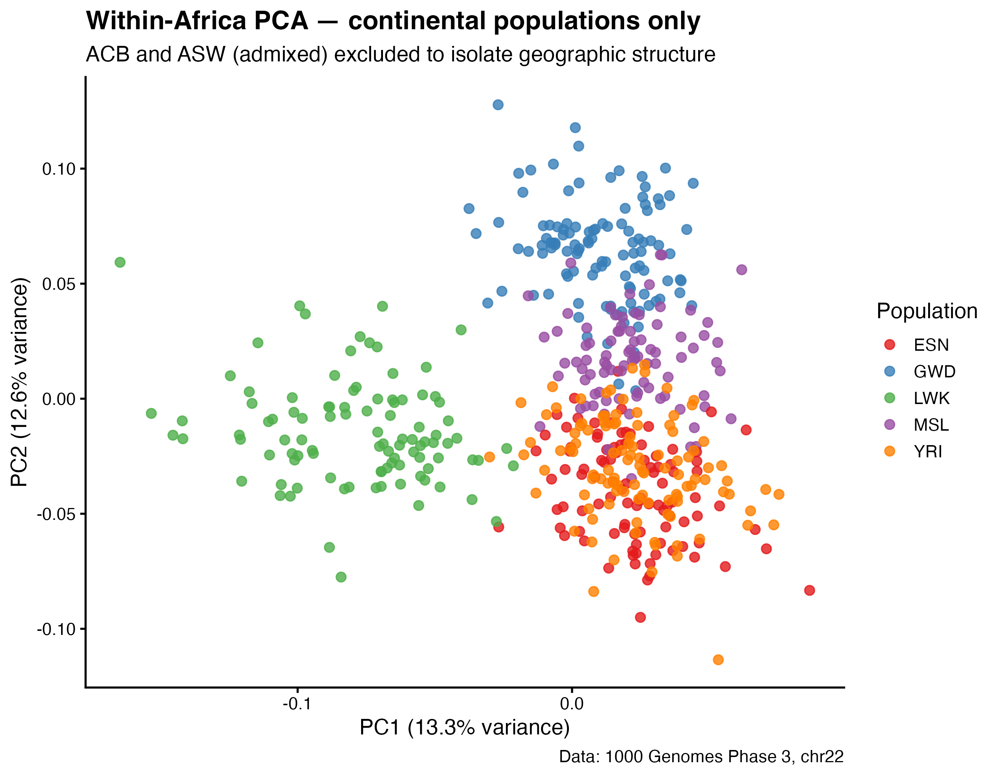

### Within-Europe PCA shows FIN separation

For comparison, within-EUR PCA shows Finnish (FIN) individuals separating from the other four European populations — consistent with known genetic isolation due to Finland's geographic and demographic history. The remaining four populations (CEU, GBR, IBS, TSI) overlap substantially on chr22.

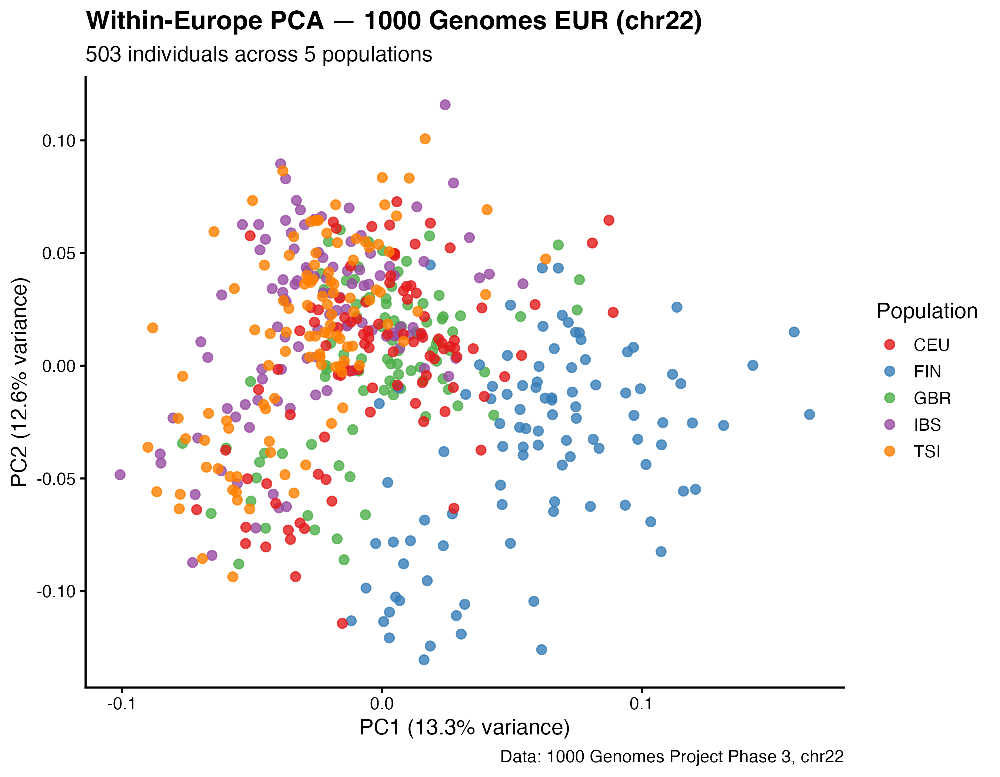

### Within-Africa Fst confirms the admixture and geography story

Pairwise Fst among all 7 AFR populations shows three tiers. All five ASW pairs rank highest (0.012–0.015), confirming European admixture inflates Fst against continental populations. Among continental populations, LWK pairs rank highest (~0.007–0.009), reflecting the West–East Africa geographic split. ESN–YRI is the lowest pair (0.001) — two Nigerian populations that are geographic and linguistic neighbours.

The maximum within-Africa Fst (~0.015) is roughly 6–7× smaller than AFR–EUR (0.098), directly demonstrating Lewontin's 1972 finding in this project's own data: most human genetic variation exists within, not between, populations.

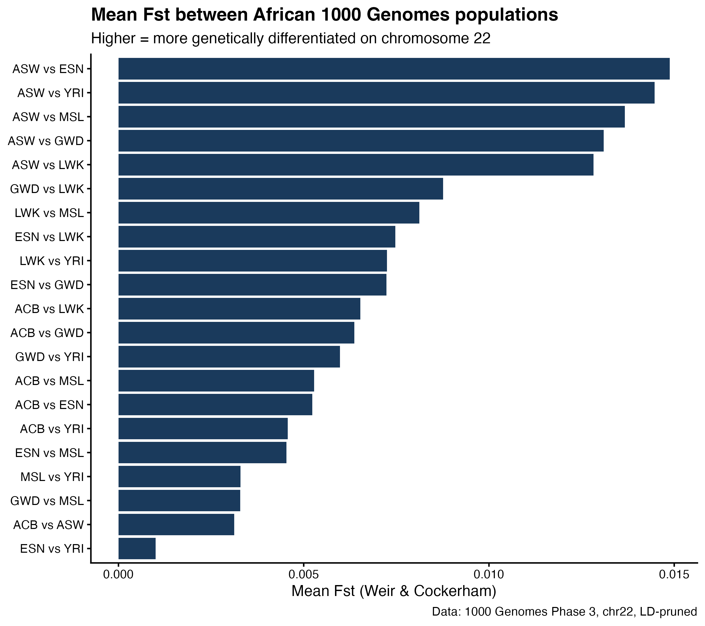

### Geographic map: diaspora admixture exceeds geographic distance

All 7 AFR sampling locations plotted on a world map, coloured by mean Fst from YRI. The most striking pattern: ASW (Oklahoma, USA) and ACB (Barbados) — both diaspora populations — show higher Fst from YRI than LWK (Kenya, ~5,500 km away). Admixture creates more genetic distance than geography does within Africa.

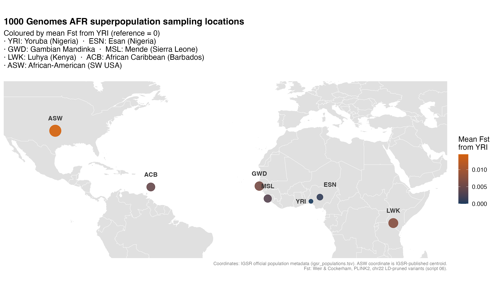

### CYP2D6/CYP2D7 region shows elevated but underpowered signal

The strongest AFR–EUR Fst signal near CYP2D6 (Fst = 0.461, chr22:42,142,019) was verified via the UCSC Genome Browser (GRCh38) to lie within **CYP2D7** — the pseudogene immediately adjacent to CYP2D6 that shares ~92–98% sequence identity with it. CYP2D6–CYP2D7 recombination is a well-documented source of hybrid alleles affecting CYP2D6 drug-metabolising activity (including the CYP2D6\*5 deletion and gene duplications).

The 50kb window mean Fst (0.1353 vs genome-wide 0.0977) does not clear statistical significance with 11 informative markers (empirical p = 0.168, 1,000 permutations). This result should be interpreted as underpowered, not negative — the MAF + LD-pruning QC pipeline used for PCA/ADMIXTURE systematically removes functional CYP2D6 variants by design. A proper pharmacogenomics analysis requires a separate pipeline retaining rare and population-specific variants (see Limitations).

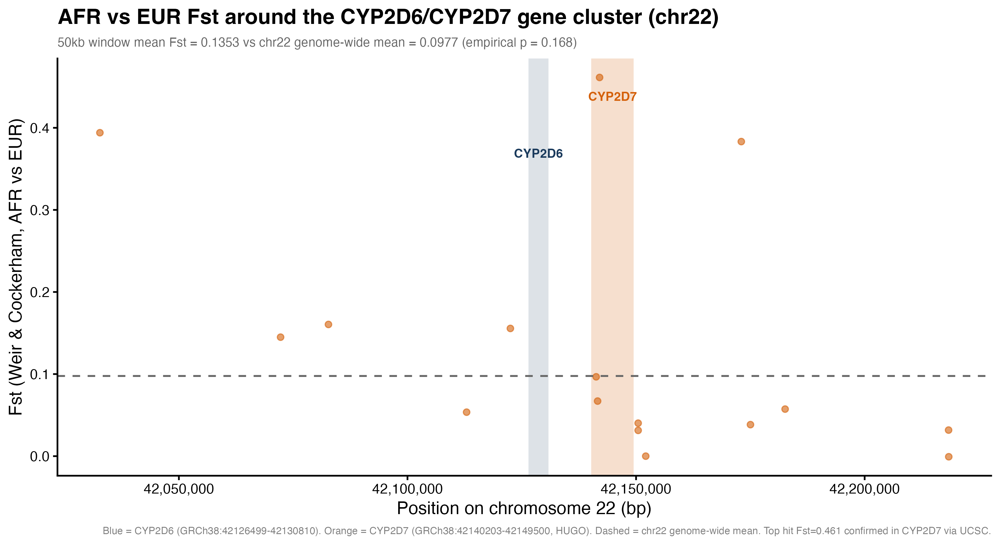

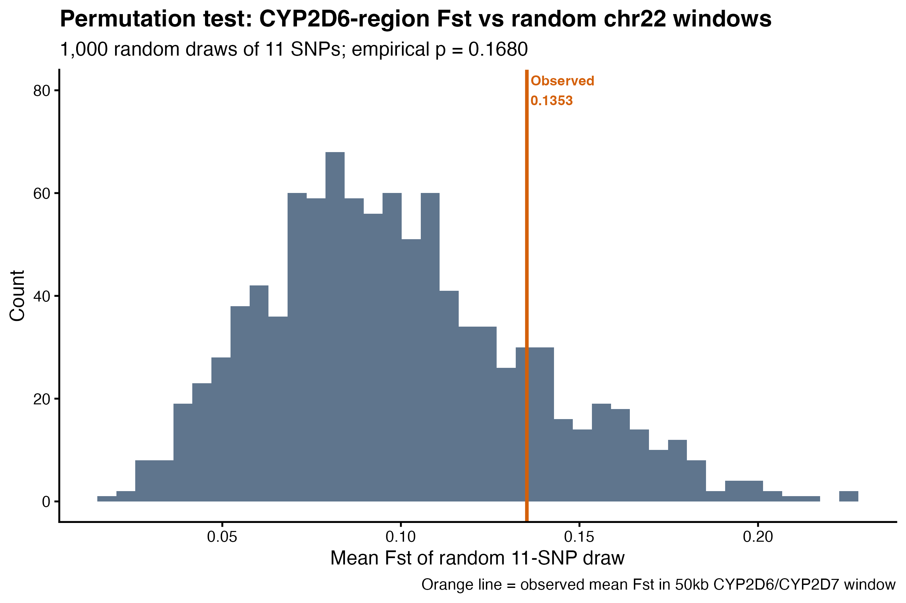

---

## Data

**Source:** 1000 Genomes Project Phase 3, 2022 high-coverage (30×) release (Byrska-Bishop et al. 2022).

| Item | Details |
|------|---------|
| VCF | `1kGP_high_coverage_Illumina.chr22.filtered.SNV_INDEL_SV_phased_panel.vcf.gz` |
| Assembly | GRCh38 / hg38 |
| Chromosome | 22 only (50.8 Mb) |
| Total samples in VCF | 3,202 (includes 698 trio-completion relatives) |
| Samples after QC | 2,504 (Phase 3 unrelated set) |
| Variants after QC | 102,467 (biallelic SNPs, MAF ≥ 5%, missingness ≤ 2%) |
| Variants after LD pruning | 5,141 (window 50 SNPs, step 10, r² < 0.1) |
| Population panel | `integrated_call_samples_v3.20130502.ALL.panel` (2,504 samples) |

**Important note on sample count:** The 2022 VCF contains 3,202 samples (the original 2,504 unrelated individuals plus 698 trio-completion relatives added for phasing). The Phase 3 panel file covers only 2,504. After a `left_join`, 698 rows have `NA` for `super_pop` — these are filtered out in every script, which is both a data-integrity fix (no population labels) and a statistical requirement (PCA and ADMIXTURE assume unrelated individuals).

---

## Methods

### Quality control and LD pruning

```
VCF (1,066,557 variants, 3,202 samples)
  │
  ├── --snps-only --max-alleles 2     → biallelic SNPs only
  ├── --geno 0.02                     → remove variants missing in >2% of samples
  ├── --maf 0.05                      → remove variants with global MAF < 5%
  │   └── 102,467 variants remaining
  │
  └── --indep-pairwise 50 10 0.1      → LD pruning (r² threshold 0.1)
      └── 5,141 variants remaining
```

### Analysis pipeline

| Step | Tool | Method | Script |
|------|------|--------|--------|
| QC + pruning | PLINK2 | See above | Terminal (see `data/raw/README.md`) |
| Global PCA | PLINK2 | `--pca 10` on pruned set | `01_pca_visualisation.R` |
| ADMIXTURE | ADMIXTURE 1.3.0 | `--cv` for K=2–6, BED input | `02_admixture_visualization.R` |
| Global Fst | PLINK2 | `--fst method=wc report-variants` | `03_fst_validation.R` |
| Within-superpop PCA | PLINK2 | `--pca 10 --keep` per superpop | `04_within_superpop_pca.R` |
| CYP2D6/CYP2D7 Fst | R | Regional filter + permutation test | `05_cyp2d6_aims.R` |
| Within-Africa Fst | PLINK2 | `--fst pop method=wc`, 7 AFR pops | `06_within_africa_fst.R` |
| Geographic map | R/ggplot2 | IGSR coordinates + Fst colouring | `07_africa_map.R` |

**Note on workflow:** Scripts 03, 04, and 06 require running PLINK2 commands in the terminal *before* executing the R code. Each script documents the required PLINK2 commands in its header comments. The R scripts then read the PLINK2 output files for visualisation and statistical analysis.

### Tools and versions

| Tool | Version | Purpose |
|------|---------|---------|
| PLINK2 | v2.0.0-a.6.9 | QC, PCA, Fst, LD pruning |
| ADMIXTURE | 1.3.0 | Unsupervised ancestry inference |
| bcftools | 1.23.1 | VCF inspection |
| R | 4.5.3 | All visualisation and statistical analysis |
| tidyverse | 2.0.0 | Data wrangling and ggplot2 |
| maps | 3.4.3 | World map polygons for geographic plot |

Environment managed via conda (`mamba create -n popgen`).

---

## Project Structure

```
01-african-genomics/
├── README.md
├── data/
│   └── raw/
│       ├── README.md                          # Download instructions for VCF
│       ├── igsr_populations.tsv               # Official IGSR coordinates (tracked)
│       └── integrated_call_samples_v3...panel # Population labels (tracked)
├── results/
│   ├── admixture/
│   │   ├── chr22_pruned.{2-6}.Q              # Ancestry proportions per K
│   │   └── log_K{2-6}.out                    # CV error logs
│   ├── chr22_fst.{POP1}.{POP2}.fst.var       # 10 global pairwise Fst files
│   ├── chr22_fst_within_afr.*.fst.var         # 21 within-Africa Fst files
│   ├── chr22_pca*.eigenvec / .eigenval        # PCA outputs (global + within-superpop)
│   ├── fst_covariate*.txt                     # PLINK2 phenotype files
│   ├── keep_*.txt                             # Sample subset lists
│   └── figures/                               # All 14 publication-ready figures
│       ├── pca_plot.png
│       ├── pca_plot_by_population.png
│       ├── admixture_K5.png
│       ├── admixture_K6.png
│       ├── admixture_cv_error.png
│       ├── fst_afr_eur_distribution.png
│       ├── fst_pairwise_comparison.png
│       ├── pca_within_afr.png
│       ├── pca_within_afr_continental.png
│       ├── pca_within_eur.png
│       ├── fst_within_africa.png
│       ├── cyp2d6_fst_region.png
│       ├── cyp2d6_permutation_test.png
│       └── africa_population_map.png
└── scripts/
    ├── 01_pca_visualisation.R
    ├── 02_admixture_visualization.R
    ├── 03_fst_validation.R
    ├── 04_within_superpop_pca.R
    ├── 05_cyp2d6_aims.R
    ├── 06_within_africa_fst.R
    └── 07_africa_map.R
```

Large genomic files (VCF, PLINK binary genotypes) are `.gitignore`d. See `data/raw/README.md` for download instructions.

---

## Reproducing This Analysis

### 1. Clone the repository

```bash
git clone https://github.com/DrTim105/african-population-genomics.git
cd african-population-genomics
```

### 2. Set up the environment

```bash
CONDA_SUBDIR=osx-64 mamba create -n popgen -c bioconda -c conda-forge \
  plink2 admixture bcftools tabix \
  r-base r-essentials r-tidyverse -y
conda activate popgen
```

**Note:** ADMIXTURE and PLINK2 are only available for x86_64 via bioconda. On Apple Silicon Macs, the `CONDA_SUBDIR=osx-64` prefix runs them under Rosetta 2 emulation.

### 3. Download the data

```bash
cd data/raw
# VCF (~425 MB)
wget https://ftp.1000genomes.ebi.ac.uk/vol1/ftp/data_collections/1000G_2504_high_coverage/working/20220422_3202_phased_SNV_INDEL_SV/1kGP_high_coverage_Illumina.chr22.filtered.SNV_INDEL_SV_phased_panel.vcf.gz

# VCF index
wget https://ftp.1000genomes.ebi.ac.uk/vol1/ftp/data_collections/1000G_2504_high_coverage/working/20220422_3202_phased_SNV_INDEL_SV/1kGP_high_coverage_Illumina.chr22.filtered.SNV_INDEL_SV_phased_panel.vcf.gz.tbi

# Population panel (already tracked in repo but can be re-downloaded)
wget https://ftp.1000genomes.ebi.ac.uk/vol1/ftp/release/20130502/integrated_call_samples_v3.20130502.ALL.panel
cd ../..
```

### 4. Run the QC pipeline

```bash
# Step 1: QC filtering + LD pruning list
plink2 \
  --vcf data/raw/1kGP_high_coverage_Illumina.chr22.filtered.SNV_INDEL_SV_phased_panel.vcf.gz \
  --maf 0.05 --geno 0.02 \
  --indep-pairwise 50 10 0.1 \
  --max-alleles 2 --snps-only \
  --out results/chr22_qc --make-pgen

# Step 2: Extract pruned variants
plink2 --pfile results/chr22_qc \
  --extract results/chr22_qc.prune.in \
  --out results/chr22_pruned --make-pgen

# Step 3: Create BED format for ADMIXTURE
plink2 --pfile results/chr22_pruned \
  --out results/chr22_pruned --make-bed

# Step 4: Run PCA
plink2 --pfile results/chr22_pruned --pca 10 --out results/chr22_pca
```

### 5. Run ADMIXTURE

```bash
cd results/admixture
for K in 2 3 4 5 6; do
  admixture --cv ../chr22_pruned.bed $K | tee log_K${K}.out
done
grep "CV error" log_K*.out
cd ../..
```

### 6. Run R scripts in order

Open each script in RStudio or run via `Rscript`. Scripts 03, 04, and 06 require terminal PLINK2 commands documented in the script headers before the R visualisation code runs.

```bash
Rscript scripts/01_pca_visualisation.R
Rscript scripts/02_admixture_visualization.R
# ... and so on through script 07
```

---

## Limitations

1. **Single chromosome.** All analyses use chr22 only (~1.6% of the genome). Genome-wide analyses would provide stronger, more representative results. Chr22 was chosen for computational tractability as a learning project.

2. **MAF filter removes Africa-specific rare variants.** The global MAF ≥ 5% threshold discards variants that are common in one population but rare globally. These are precisely the variants that drive Africa's elevated genetic diversity — explaining why the diversity ratio in this project (1.04×) is lower than the ~1.4× typically reported in unfiltered datasets.

3. **LD pruning removes functional pharmacogenomic variants.** The `--indep-pairwise` step removed all variants inside CYP2D6's 4.3kb gene body (expected: the gene is smaller than the average 9.9kb SNP spacing in the pruned set). Functional CYP2D6 variants are in high LD with flanking common SNPs and were removed as "redundant." A proper pharmacogenomics analysis requires retaining these variants — see Future Directions.

4. **CYP2D6 regional test is underpowered.** The 50kb window permutation test (p = 0.168) had only 11 informative SNPs. This is a power limitation, not evidence against differentiation. The individual CYP2D7 hit (Fst = 0.461) remains biologically noteworthy regardless of the regional average.

5. **Phase mismatch between VCF and panel.** The 2022 high-coverage VCF (3,202 samples) and the 2013 Phase 3 panel (2,504 samples) require careful joining — 698 trio-completion samples have no population labels and must be filtered.

6. **IGSR coordinates are approximate.** Population sampling coordinates from `igsr_populations.tsv` are published centroids, not precise GPS locations of sampling sites. The ESN coordinate maps to the Abuja/Niger State region rather than the Esan homeland in Edo State.

7. **Chromosome 22 may not be representative.** It is one of the smallest autosomes and is relatively gene-dense. Results on larger, more representative chromosomes may differ quantitatively.

8. **No formal multiple-testing correction** was applied to Fst comparisons. Results are reported as descriptive statistics and exploratory analyses, not hypothesis tests with controlled family-wise error rates.

---

## Companion Project

[**genes-and-geography**](https://github.com/DrTim105/genes-and-geography) implements a parallel analysis of the same biological question using a from-scratch Python/scikit-learn pipeline (no PLINK2, no ADMIXTURE). Comparing the two projects demonstrates understanding of both industry-standard genomics tools (project 1) and the underlying algorithms (project 1b). Key differences:

| | Project 1 (this repo) | Project 1b |
|---|---|---|
| Tools | PLINK2, ADMIXTURE, R/ggplot2 | Python, scikit-learn, pysam, Altair |
| QC | MAF filter + LD pruning | None (raw dosage matrix) |
| PCA | PLINK2 genetics-aware standardisation | sklearn raw PCA |
| Fst | Weir & Cockerham (1984) via PLINK2 | Hand-rolled variance-form |
| Data | Phase 3 (2,504 samples, 26 pops, 5 superpops) | Phase 1 (1,092 samples, 14 pops, 4 superpops) |
| Ancestry | ADMIXTURE (model-based) | Not implemented |
| Significance | Permutation test, bootstrap CI | None |

---

## References

- Auton, A. et al. (2015). A global reference for human genetic variation. *Nature*, 526, 68–74. [1000 Genomes Phase 3]
- Byrska-Bishop, M. et al. (2022). High-coverage whole-genome sequencing of the expanded 1000 Genomes Project cohort. *Cell*, 185, 3426–3440. [30× high-coverage release]
- Weir, B. S. & Cockerham, C. C. (1984). Estimating F-statistics for the analysis of population structure. *Evolution*, 38, 1358–1370.
- Lewontin, R. C. (1972). The apportionment of human diversity. *Evolutionary Biology*, 6, 381–398.
- Ramachandran, S. et al. (2005). Support from the relationship of genetic and geographic distance in human populations for a serial founder effect originating in Africa. *PNAS*, 102, 15942–15947.
- Novembre, J. et al. (2008). Genes mirror geography within Europe. *Nature*, 456, 98–101.
- Gaedigk, A. et al. (2018). The Pharmacogene Variation (PharmVar) Consortium. *Clinical Pharmacology & Therapeutics*, 103, 399–401. [CYP2D6 star allele catalog]
- Crews, K. R. et al. (2014). Clinical Pharmacogenetics Implementation Consortium guidelines for cytochrome P450 2D6 genotype and codeine therapy. *Clinical Pharmacology & Therapeutics*, 95, 376–382.

---

## Author

**Dr Salihu Timothy** (M.B.Ch.B)  
Aspiring bioinformatician | Medical doctor  
GitHub: [@DrTim105](https://github.com/DrTim105)

---

## License

This project is for educational and portfolio purposes. The 1000 Genomes data is publicly available under the Fort Lauderdale principles. All analysis code is original.